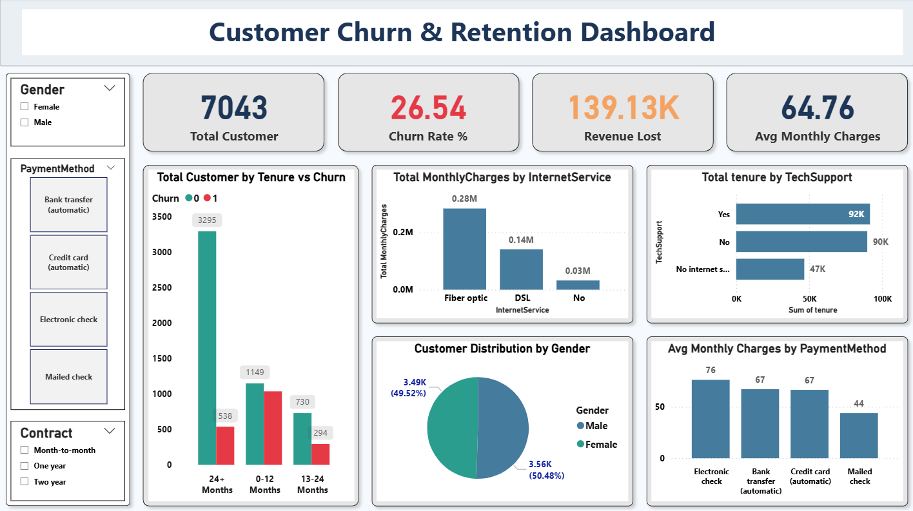

📊 Customer Churn & Retention Analysis
---------------------------------------------
📌 Project Overview : 

This project analyzes customer churn behavior for a telecom company to identify high-risk customer segments, revenue impact, and retention opportunities. The objective is to use SQL, Python, and Power BI to deliver data-driven business insights.

🎯 Business Problem :

- The company is experiencing increasing customer churn, leading to revenue loss. The goal of this project is to:
- Calculate overall churn rate
- Identify high-risk customer segments
- Measure revenue impact due to churn
- Provide data-driven retention strategies

🛠 Tools & Technologies Used :

- SQL (CTEs, Window Functions, Aggregations)
- Python (Pandas, NumPy, Matplotlib, Seaborn)
- Power BI (DAX, Data Modeling, Dashboard Development)
- Excel (Data Validation & Preprocessing)

🗂 Dataset : 

- Telco Customer Churn Dataset
- ~7,000 customer records
- Features include customer demographics, tenure, services, charges, and churn status

🔎 Project Workflow : 
-----------------------
1️⃣ Data Cleaning (Python)  : 

- Handled missing values
- Converted data types
- Created churn binary variable
- Performed exploratory data analysis

2️⃣ SQL Analysis :

- Calculated overall churn rate
- Analyzed churn by contract type
- Segmented churn by tenure groups
- Measured revenue lost due to churn
- Used CTEs and window functions for advanced analysis

3️⃣ Dashboard Development (Power BI) :

- Created an executive-level dashboard including:
- Total Customers
- Churn Rate %
- Revenue Lost
- Churn by Contract
- Churn by Tenure
- Risk Segment Analysis

  ## Dashboard Preview:
  

📈 Key Insights :

- Month-to-month contract customers have the highest churn rate.
- Customers with tenure below 12 months show higher churn probability.
- Higher monthly charges correlate with increased churn.
- Significant revenue is lost from short-term contract customers.

💡 Business Recommendations :

- Provide incentives for long-term contracts.
- Improve onboarding experience during first 6 months.
- Offer targeted discounts to high monthly charge customers.
- Develop loyalty programs for high-value customers.

📂 Project Structure :

Customer-Churn-Analysis/
- dataset/
- customer_churn.ipynb
- cleaned_churn.csv
- customer_churn_analysis(sql quiries).sql
- churn_analysis_dashboard(PowerBI).pbix
- Business Probelm - customer churn & retention.pdf
- customer project overview.pdf
- customer-churn & retention.pdf
- matplotlib & seaborn visulas(#Just tried)

🚀 Outcome :
        This project demonstrates end-to-end data analysis workflow including data cleaning, SQL-based KPI analysis, dashboard visualization, and business reporting.
